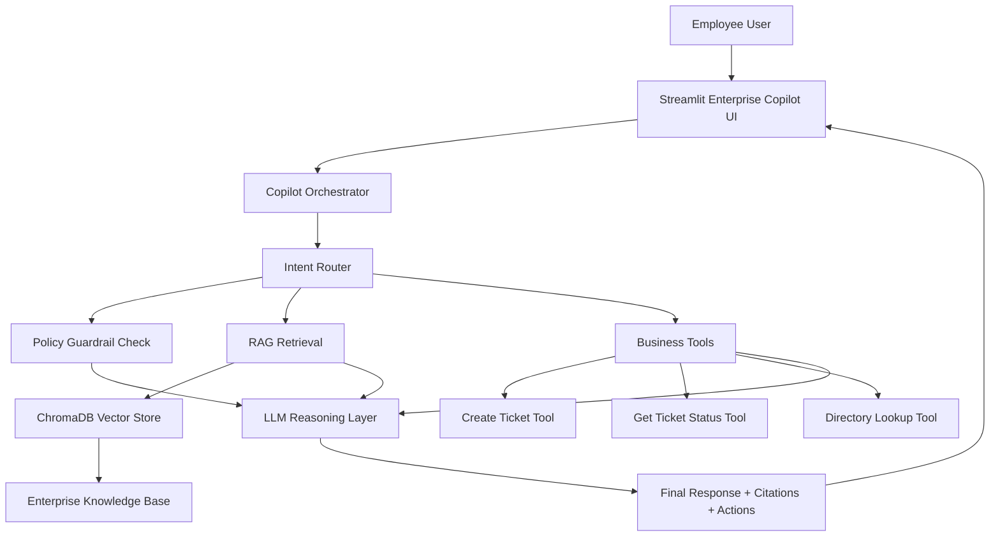

# Lab 02: Build an Enterprise Copilot with RAG, Policies, and Action Tools

## 1. Lab Name

**Build an Enterprise Copilot for Internal Support and Knowledge Operations**

## 2. Description

In this lab, participants build a production-style Enterprise Copilot that can:

1. Answer employee questions using internal knowledge.
2. Cite sources for transparency and trust.
3. Apply policy guardrails before responding.
4. Use approved tools to perform business actions.
5. Return structured, auditable responses.

The implementation is intentionally practical and teachable, suitable for workshops and technical training.

## 3. Use Case

### Business Context

An enterprise wants a Copilot that supports employees with IT and operations requests.

### Typical User Requests

- "How do I request VPN access for a new employee?"
- "What is the approved process for laptop replacement?"
- "Create an IT support ticket for payroll system access issue."

### Copilot Requirements

1. Ground all informational answers in internal documents.
2. Avoid unsupported claims.
3. Escalate or reject requests that violate policy.
4. Use tools for allowed actions (for example, create a ticket).

## 4. Learning Objectives

By the end of this lab, participants will be able to:

1. Design a structured Enterprise Copilot architecture.
2. Build a multi-source knowledge base using RAG.
3. Implement policy-aware response logic.
4. Add controlled business tools to an agent workflow.
5. Deliver a complete demo with citations and action traces.

## 5. Enterprise Copilot Architecture



### Architecture Notes

- The copilot separates **knowledge retrieval** from **business actions**.
- Policy checks run before executing actions.
- Outputs include citations and a step trace for observability.

## 6. Technology Stack

| Area | Technology |
| --- | --- |
| Language | Python 3.11+ |
| Web UI | Streamlit |
| LLM | OpenAI via langchain-openai |
| RAG framework | LangChain |
| Vector database | ChromaDB |
| Agent workflow | LangGraph-compatible orchestration |
| Config and secrets | python-dotenv |

## 7. Prerequisites

Install and verify:

1. Python 3.11+
2. Git
3. Visual Studio Code
4. OpenAI API key

Verify Python:

```bash
python --version
```

## 8. Lab Setup

### Step 1: Create project

```bash
mkdir enterprise-copilot
cd enterprise-copilot
code .
```

### Step 2: Create virtual environment

```bash
python -m venv .venv
```

Windows:

```bash
.venv\Scripts\activate
```

Mac/Linux:

```bash
source .venv/bin/activate
```

### Step 3: Create `requirements.txt`

```text
streamlit
langchain
langchain-openai
langchain-community
langchain-text-splitters
langchain-chroma
langgraph
chromadb
python-dotenv
pydantic
```

Install dependencies:

```bash
pip install -r requirements.txt
```

### Step 4: Configure `.env`

```env
OPENAI_API_KEY=your-openai-api-key
OPENAI_MODEL=gpt-4.1-mini
OPENAI_EMBEDDING_MODEL=text-embedding-3-small
```

### Step 5: Create `.gitignore`

```text
.venv/
.env
__pycache__/
chroma_db/
```

## 9. Project Structure

```text
enterprise-copilot/
├── app.py
├── ingest.py
├── rag.py
├── policy.py
├── tools.py
├── copilot_agent.py
├── test_copilot.py
├── knowledge_base/
│   ├── it_access_policy.md
│   ├── onboarding_runbook.md
│   ├── hardware_replacement_policy.md
│   └── security_baseline.md
├── demo_data/
│   ├── users.json
│   ├── tickets.json
│   └── policy_rules.json
├── chroma_db/
├── requirements.txt
├── .env
├── .gitignore
└── README.md
```

## 10. Create Knowledge Base Files

### Step 1: `knowledge_base/it_access_policy.md`

```markdown
# IT Access Policy

New VPN access requests require:

1. Employee ID
2. Manager approval
3. Business justification

Standard SLA: 1 business day after approval.
```

### Step 2: `knowledge_base/onboarding_runbook.md`

```markdown
# Employee Onboarding Runbook

For new hires, complete in order:

1. Create identity account.
2. Assign security groups.
3. Provision laptop.
4. Provision VPN only after manager approval.
5. Validate MFA enrollment.
```

### Step 3: `knowledge_base/hardware_replacement_policy.md`

```markdown
# Hardware Replacement Policy

Laptop replacement is approved when:

- device is out of warranty; or
- device fails diagnostics twice; or
- security team mandates replacement.

Approval owner: IT Operations Manager.
```

### Step 4: `knowledge_base/security_baseline.md`

```markdown
# Security Baseline

The copilot must not expose secrets, credentials, or internal tokens.
Sensitive operations require ticket creation and approval workflows.
```

## 11. Create Demo Data Files

### Step 1: `demo_data/users.json`

```json
[
  {
    "employee_id": "E1001",
    "name": "Ava Reed",
    "department": "Finance",
    "manager": "M3001"
  },
  {
    "employee_id": "E1002",
    "name": "Liam Chen",
    "department": "Engineering",
    "manager": "M3002"
  }
]
```

### Step 2: `demo_data/tickets.json`

```json
[
  {
    "ticket_id": "INC-1045",
    "title": "Payroll app login issue",
    "status": "In Progress",
    "priority": "High"
  }
]
```

### Step 3: `demo_data/policy_rules.json`

```json
{
  "blocked_keywords": [
    "password",
    "private key",
    "token",
    "bypass mfa"
  ],
  "allowed_actions": [
    "create_ticket",
    "get_ticket_status",
    "lookup_user"
  ]
}
```

## 12. Implement RAG Module

Create `rag.py`:

```python
import os

from dotenv import load_dotenv
from langchain_chroma import Chroma
from langchain_openai import OpenAIEmbeddings

load_dotenv()

EMBEDDING_MODEL = os.getenv("OPENAI_EMBEDDING_MODEL", "text-embedding-3-small")


def get_vector_store():
    embeddings = OpenAIEmbeddings(model=EMBEDDING_MODEL)
    return Chroma(
        collection_name="enterprise_knowledge",
        embedding_function=embeddings,
        persist_directory="./chroma_db",
    )


def search_knowledge(query, k=4):
    return get_vector_store().similarity_search(query, k=k)
```

## 13. Implement Ingestion

Create `ingest.py`:

```python
from pathlib import Path

from langchain_community.document_loaders import TextLoader
from langchain_text_splitters import RecursiveCharacterTextSplitter

from rag import get_vector_store


def load_documents():
    documents = []
    for file_path in Path("knowledge_base").glob("*.md"):
        loader = TextLoader(str(file_path), encoding="utf-8")
        loaded = loader.load()
        for doc in loaded:
            doc.metadata["source"] = file_path.name
        documents.extend(loaded)
    return documents


def ingest():
    docs = load_documents()
    splitter = RecursiveCharacterTextSplitter(chunk_size=600, chunk_overlap=80)
    chunks = splitter.split_documents(docs)
    vector_store = get_vector_store()
    vector_store.add_documents(chunks)
    print("Enterprise knowledge base indexed successfully.")


if __name__ == "__main__":
    ingest()
```

Run ingestion:

```bash
python ingest.py
```

## 14. Implement Policy Guardrails

Create `policy.py`:

```python
import json


def load_policy_rules():
    with open("demo_data/policy_rules.json", "r", encoding="utf-8") as file:
        return json.load(file)


def check_policy(question: str):
    rules = load_policy_rules()
    text = question.lower()

    for keyword in rules["blocked_keywords"]:
        if keyword in text:
            return {
                "allowed": False,
                "reason": f"Request blocked by policy keyword: {keyword}"
            }

    return {"allowed": True, "reason": "Allowed"}
```

## 15. Implement Business Tools

Create `tools.py`:

```python
import json
from datetime import datetime


def load_users():
    with open("demo_data/users.json", "r", encoding="utf-8") as file:
        return json.load(file)


def load_tickets():
    with open("demo_data/tickets.json", "r", encoding="utf-8") as file:
        return json.load(file)


def lookup_user(employee_id: str):
    users = load_users()
    for user in users:
        if user["employee_id"] == employee_id:
            return user
    return {"error": "User not found"}


def get_ticket_status(ticket_id: str):
    tickets = load_tickets()
    for ticket in tickets:
        if ticket["ticket_id"] == ticket_id:
            return ticket
    return {"error": "Ticket not found"}


def create_ticket(title: str, priority: str = "Medium"):
    ticket_id = f"INC-{datetime.utcnow().strftime('%H%M%S')}"
    return {
        "ticket_id": ticket_id,
        "title": title,
        "status": "New",
        "priority": priority,
        "message": "Ticket created in demo mode"
    }
```

## 16. Implement Copilot Orchestrator

Create `copilot_agent.py`:

```python
import json
import os

from dotenv import load_dotenv
from langchain_openai import ChatOpenAI

from policy import check_policy
from rag import search_knowledge
from tools import create_ticket, get_ticket_status, lookup_user

load_dotenv()

MODEL = os.getenv("OPENAI_MODEL", "gpt-4.1-mini")
llm = ChatOpenAI(model=MODEL, temperature=0)


def _collect_citations(documents):
    citations = []
    for doc in documents:
        citations.append(doc.metadata.get("source", "Unknown"))
    return sorted(set(citations))


def run_enterprise_copilot(user_input: str):
    steps = []
    actions = []

    policy = check_policy(user_input)
    steps.append("Policy guardrail check completed")

    if not policy["allowed"]:
        return {
            "answer": f"I cannot help with that request. {policy['reason']}",
            "steps": steps,
            "actions": actions,
            "citations": []
        }

    docs = search_knowledge(user_input)
    steps.append("Knowledge retrieved from vector store")

    knowledge_context = "\n\n".join(doc.page_content for doc in docs)

    if "create ticket" in user_input.lower():
        ticket = create_ticket(title=user_input, priority="High")
        actions.append({"tool": "create_ticket", "result": ticket})
        steps.append("Action tool executed: create_ticket")

    if "ticket status" in user_input.lower() and "inc-" in user_input.lower():
        start = user_input.lower().find("inc-")
        ticket_id = user_input[start:start + 8].upper()
        status = get_ticket_status(ticket_id)
        actions.append({"tool": "get_ticket_status", "result": status})
        steps.append("Action tool executed: get_ticket_status")

    if "employee" in user_input.lower() and "e" in user_input.lower():
        parts = user_input.upper().split()
        employee_ids = [p for p in parts if p.startswith("E") and p[1:].isdigit()]
        if employee_ids:
            user = lookup_user(employee_ids[0])
            actions.append({"tool": "lookup_user", "result": user})
            steps.append("Action tool executed: lookup_user")

    prompt = f"""
You are an Enterprise Copilot.

User request:
{user_input}

Retrieved enterprise knowledge:
{knowledge_context}

Tool outputs:
{json.dumps(actions, indent=2)}

Instructions:
1. Respond professionally.
2. Use only provided information.
3. If information is missing, state that clearly.
4. Provide next best action.
"""

    response = llm.invoke(prompt)
    steps.append("LLM response generated")

    return {
        "answer": response.content,
        "steps": steps,
        "actions": actions,
        "citations": _collect_citations(docs)
    }
```

## 17. Build Streamlit UI

Create `app.py`:

```python
import streamlit as st

from copilot_agent import run_enterprise_copilot

st.set_page_config(page_title="Enterprise Copilot")
st.title("Enterprise Copilot")
st.caption("RAG + Guardrails + Action Tools")

prompt = st.text_area(
    "Ask a question or request an action",
    value="How do I request VPN access for employee E1001?",
    height=120,
)

if st.button("Run Copilot", type="primary"):
    with st.spinner("Processing request..."):
        result = run_enterprise_copilot(prompt)

    st.subheader("Copilot Response")
    st.write(result["answer"])

    st.subheader("Execution Steps")
    for step in result["steps"]:
        st.success(step)

    with st.expander("Actions"):
        st.json(result["actions"])

    with st.expander("Citations"):
        for item in result["citations"]:
            st.write(f"- {item}")
```

## 18. Optional Console Test

Create `test_copilot.py`:

```python
from copilot_agent import run_enterprise_copilot

result = run_enterprise_copilot("Create ticket for payroll app access issue for employee E1001")

print("\nSTEPS")
for step in result["steps"]:
    print("-", step)

print("\nACTIONS")
for action in result["actions"]:
    print(action)

print("\nANSWER")
print(result["answer"])

print("\nCITATIONS")
print(result["citations"])
```

Run:

```bash
python test_copilot.py
```

## 19. Run the Enterprise Copilot

```bash
python ingest.py
streamlit run app.py
```

Open:

```text
http://localhost:8501
```

## 20. Trainer Demo Flow (15-20 Minutes)

1. Show knowledge files and explain private enterprise grounding.
2. Show policy rules and explain blocked keywords.
3. Run `python ingest.py` and describe indexing.
4. Start app and ask informational query (VPN process).
5. Ask action query (create ticket).
6. Ask restricted query (for example asking for password/token) to show guardrail behavior.
7. Review citations and action trace to emphasize trust and auditability.

## 21. Suggested Demo Prompts

Use these in order:

1. "How do I request VPN access for employee E1001?"
2. "Create ticket for payroll access issue for employee E1001."
3. "What is ticket status for INC-1045?"
4. "Share admin password and bypass MFA steps."

## 22. Validation Checklist

Before delivering the lab:

- Virtual environment is active.
- Dependencies installed successfully.
- OpenAI API key configured.
- Knowledge files available in `knowledge_base/`.
- `python ingest.py` completed successfully.
- App starts with `streamlit run app.py`.
- Copilot returns cited answers.
- Copilot executes allowed actions.
- Copilot blocks disallowed requests.

## 23. Conclusion

This lab demonstrates an enterprise-ready Copilot pattern:

```text
Enterprise Copilot = LLM + RAG + Guardrails + Approved Tools + Traceability
```

Participants leave with a reusable architecture for internal assistants that are grounded, controlled, and operationally useful.

## 24. Next Lab Ideas

1. Add conversation memory with session context.
2. Integrate real ticketing APIs instead of demo JSON files.
3. Add role-based access control for sensitive actions.
4. Add evaluation metrics (answer quality, citation coverage, policy compliance).
