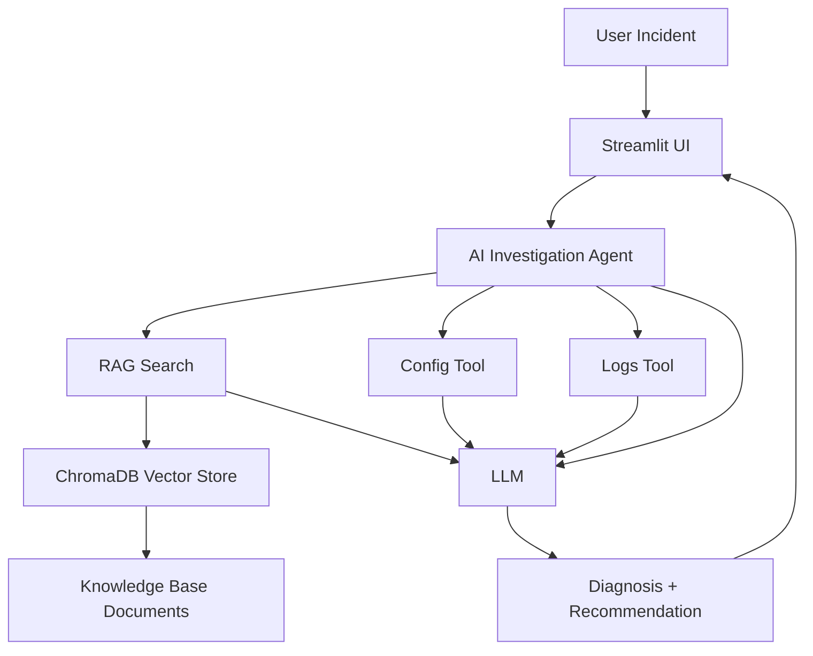

# Lab 03: Build an AI IT Support Assistant with RAG and Agent Tools

## 1. Lab Name

**Build an AI IT Support Assistant Using RAG and Agent-Driven Investigation**

## 2. Description

This lab teaches participants how to build a practical AI support assistant that:

1. Accepts an IT incident from a user.
2. Retrieves internal troubleshooting knowledge using RAG.
3. Reads application configuration and logs through tools.
4. Produces a grounded root-cause analysis and recommended fix.

The implementation uses Python, Streamlit, LangChain, ChromaDB, and LangGraph-compatible agent patterns.

## 3. Use Case

### Business Context

A production service called **Order API** cannot connect to its MySQL database.

### Known State

Current app configuration:

```text
DB_HOST=mysql-prod
DB_PORT=3306
```

Expected production configuration from internal documentation:

```text
DB_HOST=mysql.internal
DB_PORT=3306
```

### Goal

Build an AI assistant that identifies the hostname mismatch by combining:

1. Retrieved enterprise knowledge (RAG).
2. Live incident evidence (config and logs tools).
3. LLM reasoning over combined context.

## 4. Learning Objectives

By the end of this lab, participants will be able to:

1. Explain why LLM-only applications are insufficient for enterprise troubleshooting.
2. Implement a basic RAG pipeline with embeddings and vector search.
3. Add tool-based data access to retrieve operational evidence.
4. Build a simple AI agent workflow for issue investigation.
5. Present an end-to-end demo with traceable reasoning inputs.

## 5. Solution Architecture



### Component Responsibilities

| Component | Responsibility |
| --- | --- |
| Streamlit UI | Captures incident description and displays investigation output |
| RAG module | Retrieves relevant internal knowledge |
| Config tool | Returns active application configuration |
| Logs tool | Returns application log evidence |
| LLM | Correlates evidence and produces diagnosis |
| Agent workflow | Orchestrates retrieval, tooling, and synthesis |

## 6. Technology Stack

| Area | Technology |
| --- | --- |
| Language | Python 3.11+ |
| UI | Streamlit |
| LLM integration | langchain-openai |
| RAG orchestration | LangChain |
| Vector database | ChromaDB |
| Agent workflow | LangGraph-compatible pattern |
| Environment management | python-dotenv |

## 7. Prerequisites

Install and verify the following before starting:

1. Python 3.11 or later
2. Git
3. Visual Studio Code
4. OpenAI API key

Verify Python:

```bash
python --version
```

Expected:

```text
Python 3.11.x
```

## 8. Lab Setup

### Step 1: Create project folder

```bash
mkdir ai-it-support-assistant
cd ai-it-support-assistant
code .
```

### Step 2: Create and activate virtual environment

```bash
python -m venv .venv
```

Windows:

```bash
.venv\Scripts\activate
```

Mac/Linux:

```bash
source .venv/bin/activate
```

### Step 3: Create dependencies file

Create `requirements.txt`:

```text
streamlit
langchain
langchain-openai
langchain-community
langchain-text-splitters
langchain-chroma
langgraph
chromadb
python-dotenv
```

Install packages:

```bash
pip install -r requirements.txt
```

### Step 4: Configure environment variables

Create `.env`:

```env
OPENAI_API_KEY=your-openai-api-key
OPENAI_MODEL=gpt-4.1-mini
OPENAI_EMBEDDING_MODEL=text-embedding-3-small
```

### Step 5: Protect secrets and generated files

Create `.gitignore`:

```text
.venv/
.env
__pycache__/
chroma_db/
```

## 9. Project Structure

Create this folder and file layout:

```text
ai-it-support-assistant/
├── app.py
├── agent.py
├── rag.py
├── tools.py
├── ingest.py
├── test_agent.py
├── knowledge_base/
│   ├── database_guide.md
│   └── troubleshooting_guide.md
├── demo_data/
│   ├── config.json
│   └── application.log
├── chroma_db/
├── requirements.txt
├── .env
├── .gitignore
└── README.md
```

## 10. Create Demo Inputs

### Step 1: Application configuration

Create `demo_data/config.json`:

```json
{
  "application": "Order API",
  "environment": "production",
  "DB_HOST": "mysql-prod",
  "DB_PORT": 3306
}
```

### Step 2: Application logs

Create `demo_data/application.log`:

```text
INFO Starting Order API
INFO Connecting to database mysql-prod:3306
ERROR Unable to connect to database mysql-prod:3306
ERROR Connection refused
```

## 11. Create Knowledge Base Content

### Step 1: Database guide

Create `knowledge_base/database_guide.md`:

```markdown
# Production Database Guide

The Order API connects to the production MySQL database.

Production database configuration:

Host: mysql.internal
Port: 3306
Database: orders

Applications running in production must use:

DB_HOST=mysql.internal
DB_PORT=3306
```

### Step 2: Troubleshooting guide

Create `knowledge_base/troubleshooting_guide.md`:

```markdown
# Database Troubleshooting Guide

If an application cannot connect to the database, perform the following checks:

1. Check the configured database hostname.
2. Check the database port.
3. Review the application logs.
4. Compare the configured hostname with the production database guide.
5. Verify that the database configuration is correct.

Common causes include:

- incorrect hostname
- incorrect port
- unavailable database
- network issues
- invalid credentials
```

## 12. Implement the RAG Layer

Create `rag.py`:

```python
import os

from dotenv import load_dotenv
from langchain_chroma import Chroma
from langchain_openai import OpenAIEmbeddings

load_dotenv()

EMBEDDING_MODEL = os.getenv("OPENAI_EMBEDDING_MODEL", "text-embedding-3-small")


def get_vector_store():
    embeddings = OpenAIEmbeddings(model=EMBEDDING_MODEL)

    return Chroma(
        collection_name="support_documents",
        embedding_function=embeddings,
        persist_directory="./chroma_db",
    )


def search_knowledge_base(query):
    vector_store = get_vector_store()
    return vector_store.similarity_search(query, k=3)
```

## 13. Implement Document Ingestion

Create `ingest.py`:

```python
from pathlib import Path

from langchain_community.document_loaders import TextLoader
from langchain_text_splitters import RecursiveCharacterTextSplitter

from rag import get_vector_store


def load_documents():
    documents = []

    for file_path in Path("knowledge_base").glob("*.md"):
        loader = TextLoader(str(file_path), encoding="utf-8")
        loaded = loader.load()

        for document in loaded:
            document.metadata["source"] = file_path.name

        documents.extend(loaded)

    return documents


documents = load_documents()

splitter = RecursiveCharacterTextSplitter(chunk_size=500, chunk_overlap=50)
chunks = splitter.split_documents(documents)

vector_store = get_vector_store()
vector_store.add_documents(chunks)

print("Knowledge base indexed successfully.")
```

Index the knowledge base:

```bash
python ingest.py
```

Expected output:

```text
Knowledge base indexed successfully.
```

## 14. Implement Tools Layer

Create `tools.py`:

```python
import json


def get_application_config():
    with open("demo_data/config.json", "r", encoding="utf-8") as file:
        return json.load(file)


def get_application_logs():
    with open("demo_data/application.log", "r", encoding="utf-8") as file:
        return file.read()
```

## 15. Implement Agent Logic

Create `agent.py`:

```python
import json
import os

from dotenv import load_dotenv
from langchain_openai import ChatOpenAI

from rag import search_knowledge_base
from tools import get_application_config, get_application_logs

load_dotenv()

MODEL = os.getenv("OPENAI_MODEL", "gpt-4.1-mini")

llm = ChatOpenAI(model=MODEL, temperature=0)


def investigate_incident(issue):
    steps = []

    documents = search_knowledge_base(issue)
    steps.append("Troubleshooting knowledge searched")

    knowledge = "\n\n".join(document.page_content for document in documents)

    config = get_application_config()
    steps.append("Application configuration checked")

    logs = get_application_logs()
    steps.append("Application logs checked")

    prompt = f"""
You are an AI IT Support Engineer.

Investigate the following issue.

USER ISSUE:
{issue}

COMPANY TROUBLESHOOTING DOCUMENTS:
{knowledge}

CURRENT APPLICATION CONFIGURATION:
{json.dumps(config, indent=2)}

APPLICATION LOGS:
{logs}

Based only on the supplied information:
1. Identify the probable root cause.
2. Explain the evidence.
3. Recommend a simple solution.

Keep the answer concise and easy to understand.
"""

    response = llm.invoke(prompt)
    steps.append("Incident analyzed")

    return {
        "answer": response.content,
        "steps": steps,
        "documents": documents,
        "config": config,
        "logs": logs,
    }
```

## 16. Validate Agent in Console

Create `test_agent.py`:

```python
from agent import investigate_incident

result = investigate_incident("Order API cannot connect to the production database. Please investigate.")

print("\nAGENT STEPS\n")
for step in result["steps"]:
    print("-", step)

print("\nAI RESPONSE\n")
print(result["answer"])
```

Run test:

```bash
python test_agent.py
```

Expected diagnosis should mention mismatch between:

```text
Current host: mysql-prod
Expected host: mysql.internal
```

## 17. Build the Streamlit App

Create `app.py`:

```python
import streamlit as st

from agent import investigate_incident

st.set_page_config(page_title="AI IT Support Assistant")
st.title("AI IT Support Assistant")
st.caption("RAG + Tools + Agent Workflow")

issue = st.text_area(
    "Describe your support problem",
    value="Order API cannot connect to the production database. Please investigate.",
    height=120,
)

if st.button("Investigate", type="primary"):
    with st.spinner("Investigating incident..."):
        result = investigate_incident(issue)

    st.subheader("Agent Activity")
    for step in result["steps"]:
        st.success(step)

    st.subheader("AI Diagnosis")
    st.write(result["answer"])

    with st.expander("Application Configuration"):
        st.json(result["config"])

    with st.expander("Application Logs"):
        st.code(result["logs"])

    with st.expander("Retrieved Knowledge"):
        for document in result["documents"]:
            source = document.metadata.get("source", "Unknown")
            st.write(f"Source: {source}")
            st.write(document.page_content)
            st.divider()
```

## 18. How to Run the Full Application

Run commands in order:

```bash
python ingest.py
streamlit run app.py
```

Open browser:

```text
http://localhost:8501
```

## 19. Trainer Demo Script

Use this live demo sequence for webinars:

1. Show `knowledge_base/database_guide.md` and highlight `mysql.internal`.
2. Show `demo_data/config.json` and highlight `mysql-prod`.
3. Run `streamlit run app.py`.
4. Submit incident text: "Order API cannot connect to the production database. Please investigate."
5. Open "Agent Activity" and narrate each step.
6. Open "Retrieved Knowledge" to prove RAG grounding.
7. Open configuration and logs to show evidence.
8. Review final diagnosis and remediation.

## 20. Demo Variations

### Variation A: Port mismatch

1. Change `DB_PORT` in `demo_data/config.json` from `3306` to `3307`.
2. Update `demo_data/application.log` to show connection failure on `3307`.
3. Re-run `python ingest.py` (optional if KB unchanged) and `streamlit run app.py`.
4. Validate whether the assistant identifies incorrect port.

### Variation B: Expanded knowledge

1. Add `knowledge_base/network_guide.md` with hostname and port guidance.
2. Re-run indexing:

```bash
python ingest.py
```

3. Re-run the incident and observe additional retrieved context.

## 21. Validation Checklist

Before delivery, verify:

- Python environment is active.
- Dependencies install successfully.
- `.env` contains valid OpenAI key and model settings.
- Knowledge files exist in `knowledge_base/`.
- `python ingest.py` completes successfully.
- `chroma_db/` is generated.
- Agent returns grounded diagnosis.
- Streamlit app starts and renders correctly.
- Retrieved knowledge, config, and logs are visible in UI.

## 22. Conclusion

This lab demonstrates a practical evolution path:

1. **LLM-only app**: answers general questions.
2. **RAG app**: answers using private enterprise knowledge.
3. **Agent workflow app**: retrieves knowledge, executes tools, and performs evidence-based diagnosis.

Final takeaway:

```text
Practical enterprise AI assistant = LLM + RAG + Tools + Workflow
```

This pattern is directly transferable to real IT operations use cases, including incident triage, runbook automation, and guided root-cause analysis.
